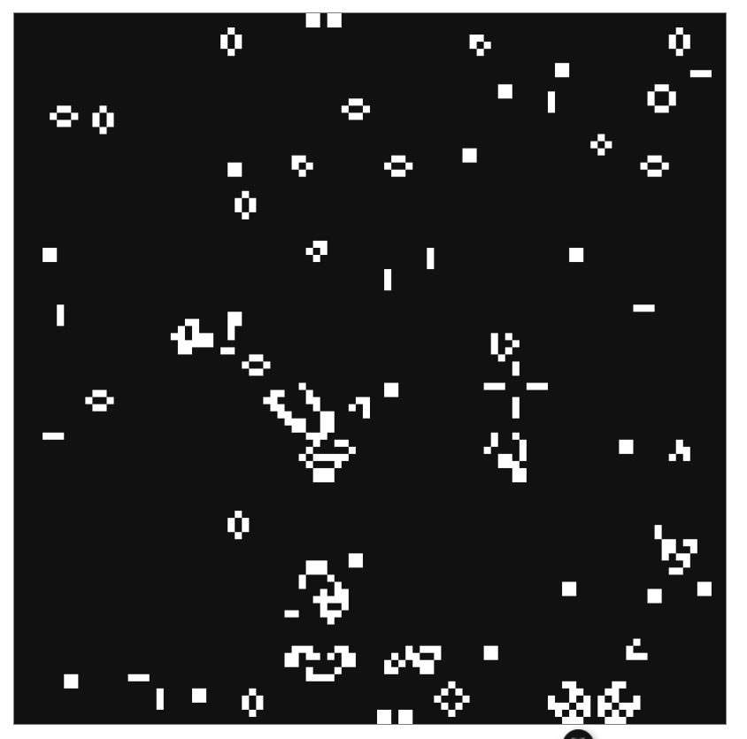

# Conway's Game Of Life in TS + Vue.

Cellular Automata.
With simple rules create complexity.

## Settings 
- N = live neighbors
- Cell = Live or Dead
- Cell neighbors = 8 (3 x 3 grid - 1 cell)

## Rules 
1. N < 2: Dies. Under population
2. N > 2 or 3: Lives
3. N > : Dies. Over population
4. Dead cell, N == 3: becomes live, reproduction
